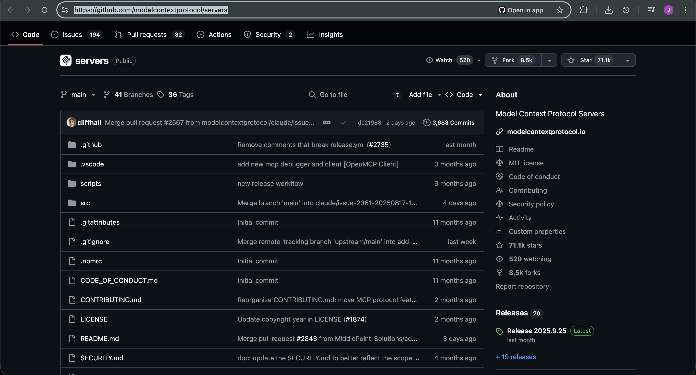
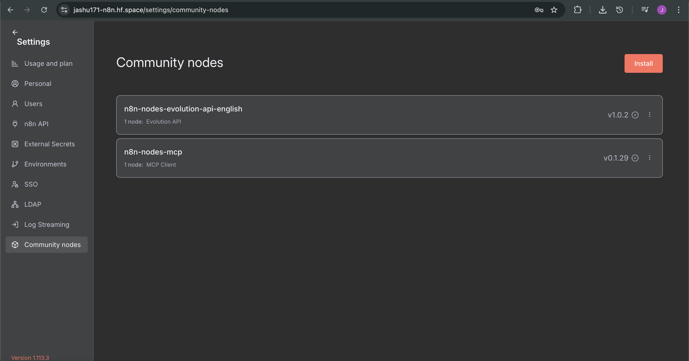

# MCP → n8n — **Airbnb Server** — Part 1: Setup

> **Scope of Part‑1**: First-time setup only. By the end, the MCP Client in n8n is configured to launch the **Airbnb MCP server** via `npx`. Execution of tools will be covered in Part‑2.

---

## Goal (one‑liner)
Run an MCP server with **npx** from **n8n**, ready to list & execute tools later.

---

## Prerequisites
- n8n instance with permission to install **Community nodes**.
- Internet access (to fetch npm packages via `npx`).
- Host can run **Node.js / npx** (typical on cloud/self‑hosted n8n).

---

## Step 1 — Choose your MCP server
- Official MCP servers index: https://github.com/modelcontextprotocol/servers  

  

For this guide we’ll use **Airbnb**:
- Repo: https://github.com/openbnb-org/mcp-server-airbnb  

  

**Commands from the Airbnb README**

Respect robots.txt:
```bash
npx -y @openbnb/mcp-server-airbnb
```

Ignore robots.txt (recommended for testing):
```bash
npx -y @openbnb/mcp-server-airbnb --ignore-robots-txt
```

We’ll put these into the n8n credential as **Command** + **Arguments**.

---

## Step 2 — Install the MCP Client (community node)

1. In n8n go to **Settings → Community nodes**.  

   
   
2. Click **Install** → paste: `n8n-nodes-mcp` → accept → **Install**.

This adds the **MCP Client** node to your canvas palette.

---

## Step 3 — Create the MCP credential (Command Line / STDIO)

You’ll create a credential that **spawns** the Airbnb MCP server with `npx`.

1. Open any workflow and search **“MCP Client”**; drop it on the canvas.  
   

2. In the node’s **Credentials**, click **Create new** → choose **Command Line (STDIO)**.

3. Fill the fields exactly:
  

**Command**
```
npx
```

**Arguments (ignore robots.txt)**
```
-y @openbnb/mcp-server-airbnb --ignore-robots-txt
```

> Prefer to respect robots.txt? Use:
```
-y @openbnb/mcp-server-airbnb
```

4. Name the credential (e.g., **MCP Airbnb (STDIO)**) → **Save**.

> **What this does:** when the MCP Client node runs, n8n starts the Airbnb MCP server process via `npx` and connects to it over **STDIO** (the MCP transport).

---

## Setup Complete (End of Part‑1)

Your workflow now contains an **MCP Client** node wired to a **Command Line (STDIO)** credential that can launch the Airbnb MCP server on demand.


---
## Part-2 N8n Workflow starts from Here 

---

# MCP → n8n (Airbnb Server)


This guide focuses **only** on wiring and using the workflow (minimal prereqs). Follow the arrows and you’ll be able to ask an **AI Agent** in n8n to **list MCP tools** and **execute** any tool from the **Airbnb MCP server**.

---

## 1) GOAL
Help a chat user ask an **AI Agent** to:  
(a) **List** Airbnb MCP tools, and  
(b) **Execute** any chosen tool with parameters — directly inside n8n.

---

## 2) PREREQUISITES (minimal)
- **MCP Client node installed**: `n8n-nodes-mcp`  
- **Command Line (STDIO) credential** that runs Airbnb MCP  
  - **Command:** `npx`  
  - **Arguments (testing):** `-y @openbnb/mcp-server-airbnb --ignore-robots-txt`
- **Gemini API key** added to the **Google Gemini Chat Model** credential.

*(That’s it. Jump to wiring + steps.)*

---

## 3) CANVAS WIRING (one line)

```
[When chat message received] → [AI Agent (Gemini + Memory + MCP List + MCP Execute)] → [Agent reply to chat]
```

---

## 4) WORKFLOW STEPS 

> Follow these steps in order. Run a quick chat test after **Step 6**.

### 1) When chat message received — **Trigger**
**Purpose** → Starts the workflow when you send a message in the n8n chat.

**Config**
- **Mode/Operation** → `When chat message received`  
  → Opens the chat entry point.

**Test**
- Click **Open chat** → type `list tools` → confirm the run reaches **AI Agent**.

---

### 2) AI Agent — **Agent Orchestrator**
**Purpose** → Reads the user request and either **lists tools** or **executes** a tool.  
It writes two keys that the MCP nodes read later:
- `Tool` *(string)* — exact tool name
- `Tool_Parameters` *(object)* — JSON matching the tool input schema

**Wire the three inputs**
- **Chat Model** → Google Gemini Chat Model  
- **Memory** → Simple Memory  
- **Tool** → connect **both** MCP nodes below (List + Execute) to this **Tool** port

**System Prompt (copy & paste)**
```
You are a helpful n8n AI Agent. You have TWO attached MCP tools:

1) "MCP List tool" → Use this to discover all available tools. Always run this first if you do not have a tool name yet.
2) "MCP Execute Tool" → Use this to run a chosen tool.

Rules:
- When the user asks to "list tools", call the MCP List tool and summarize names + short descriptions.
- When the user asks to "run/execute <toolName>", set the following keys for downstream nodes:
  - Tool = <exact tool name>
  - Tool_Parameters = a strict JSON object matching the tool's input schema.
- Always produce valid JSON for Tool_Parameters (double quotes, correct types).
- If parameters are missing, ask a single, short clarification question.
- Keep answers concise and action-oriented.
```

*No other settings required for the first run.*

---

### 3) Google Gemini Chat Model — **LLM**
**Purpose** → Provides reasoning + tool selection for the agent.

**Config**
- **Credential** → your Gemini key  
- **Temperature** → `0.2`  → lower is more deterministic  
- **Max Tokens** → leave default *(or set ~`1024`)*

---

### 4) Simple Memory — **Buffer Window**
**Purpose** → Keeps short context so the agent remembers recent turns.

**Config**
- **contextWindowLength** → `20`

---

### 5) MCP client **List Tool** — *MCP Client*
**Purpose** → Fetch all tools the Airbnb MCP server exposes.

**Config**
- **Action/Operation** → `List available tools`  
- **Credentials** → *(Command Line / STDIO)* with:  
  - **Command:** `npx`  
  - **Arguments:** `-y @openbnb/mcp-server-airbnb --ignore-robots-txt`

**Sanity check** → Click **Execute once** → you should get an **array** of tools with `name`, `description`, `input_schema`.

---

### 6) MCP client **Execute Tool** — *MCP Client*
**Purpose** → Run one tool by name with JSON parameters.

**Config**
- **Action/Operation** → `Execute a tool`
- **Tool** *(Expression)*
```javascript
={{ $fromAI("Tool", "the tool is selected") }}
```
- **Tool Parameters** *(Expression)*
```javascript
={{ /*n8n-auto-generated-fromAI-override*/ $fromAI("Tool_Parameters", ``, "json") }}
```
- **Credentials** → *(same Command Line / STDIO as List)*

**What those expressions do**
- `$fromAI("Tool")` reads the exact tool name the **AI Agent** sets.  
- `$fromAI("Tool_Parameters","", "json")` reads a **JSON object** (schema-compatible) from the Agent.

---
## Output

Example outputs from a working run:
- 
---

- 
---

- 


---

## ✅ Quick End‑to‑End Test (chat script)
1. In n8n chat, send → **“List available tools.”**  
   → Agent calls **MCP List tool** and prints tools.
2. Pick one exact tool name. Then send →  
   **“Execute `TOOL_NAME` with `{ "location": "Hyderabad", "guests": 4, "budget": 40000 }`.”**  
   → Agent sets **Tool** + **Tool_Parameters** → **MCP Execute Tool** runs.
3. Check the **MCP Execute Tool** output panel for results/links.


---

## If something doesn’t run (fast checks)
- Agent not calling tools → Make sure **both MCP nodes** connect to the Agent’s **Tool** port and the **System Prompt** above is set.  
- Empty tool list → Use the “ignore robots” arguments; confirm host can run `npx`.  
- Invalid parameters → Read the tool’s `input_schema` from **List** output; fix names/types; resend.

---

*End of ultra‑clear, steps‑only guide.*
