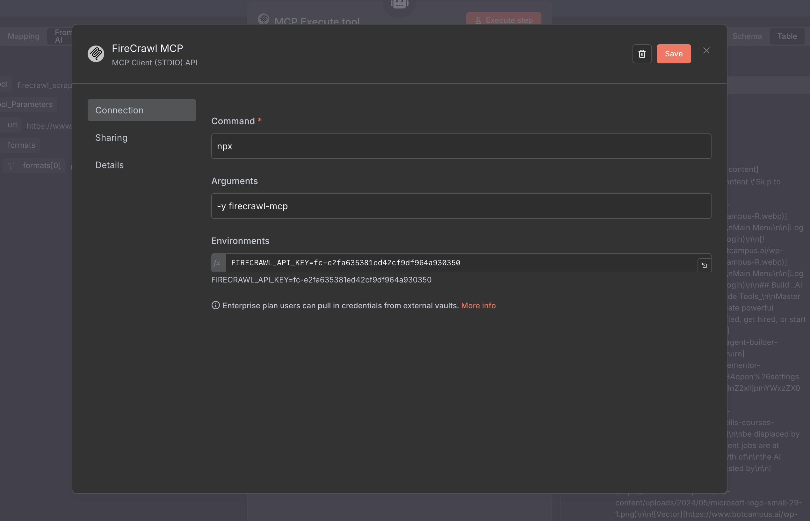
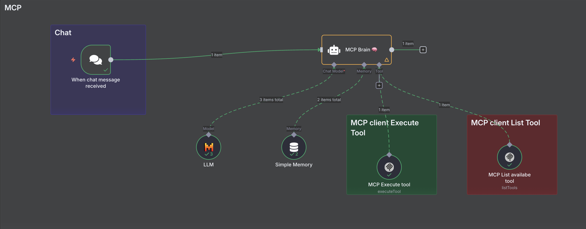
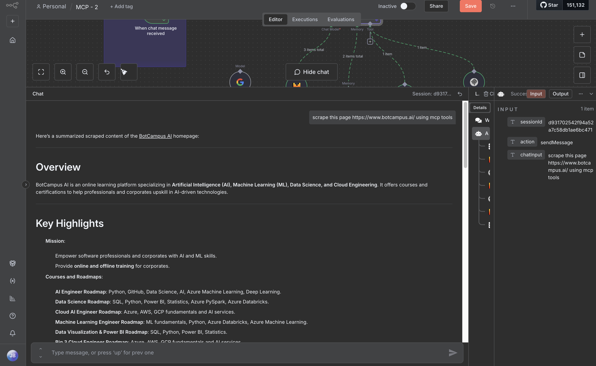

# MCP Web‑Scraping with Firecrawl (n8n + MCP Client) — Super‑Ultra Detailed

## 1) GOAL
Make an AI Agent inside n8n that can:
- **List** the Firecrawl MCP tools
- **Execute** the right tool to **scrape** a URL and send **clean text** back to chat

---

## 2) PREREQUISITES

> **Visibility requirement (must‑read):** your n8n must be publicly reachable — **Cloud n8n**, **self‑hosted with a public URL**, or **ngrok** with a stable public tunnel.

### Required Accounts, API Keys & Installs
- **Firecrawl account + API key** → create it here: https://www.firecrawl.dev/app
- **Firecrawl MCP Server repo/docs** → https://github.com/firecrawl/firecrawl-mcp-server
- **n8n** (latest) with **MCP Client (STDIO) API** node installed: `n8n-nodes-mcp`
- **Mistral Cloud** API key (for the LLM chat model)

### Create the MCP Credential (once)
**Credential name:** `FireCrawl Web-scrapping MCP`

→ **Command:** `npx`  
→ **Arguments:** `-y firecrawl-mcp`  
→ **Environments:** `FIRECRAWL_API_KEY=<your-firecrawl-key>`



**Optional (equivalent) JSON config**:
```json
{
  "mcpServers": {
    "firecrawl-mcp": {
      "command": "npx",
      "args": ["-y", "firecrawl-mcp"],
      "env": { "FIRECRAWL_API_KEY": "YOUR-API-KEY" }
    }
  }
}
```

---

## 3) CANVAS WIRING (one line + visual)

**Flow →** **When chat message received** → **MCP Brain 🧠 (Agent)**  
↳ **Chat Model:** LLM (Mistral `mistral-large-latest`)  
↳ **Memory:** Simple Memory (window 20)  
↳ **Tools:** MCP List availabe tool, MCP Execute tool → **Agent reply**



---

## 4) WORKFLOW STEPS (one block per node)

### 4.1) When chat message received (Trigger)
→ Add **When chat message received**  
→ Leave defaults

---

### 4.2) LLM (Chat Model)
→ Add **LLM**  
→ Provider: **Mistral Cloud**  
→ Model: **`mistral-large-latest`**  
→ Connect to **MCP Brain 🧠 → Chat Model**

---

### 4.3) Simple Memory
→ Add **Simple Memory**  
→ **Context window length:** `20`  
→ Connect to **MCP Brain 🧠 → Memory**

---

### 4.4) MCP List availabe tool
→ Add **MCP Client (STDIO) API** node  
→ **Name exactly:** `MCP List availabe tool`  
→ **Credentials:** `FireCrawl Web-scrapping MCP`  
→ No params (returns tool names for the Agent)

---

### 4.5) MCP Execute tool
→ Add **MCP Client (STDIO) API** node  
→ **Name exactly:** `MCP Execute tool`  
→ **Operation:** `executeTool`  
→ **Credentials:** `FireCrawl Web-scrapping MCP`  
→ **Tool Name (Expression):**
```
={{ $fromAI("Tool","the tool is selected") }}
```
→ **Tool Parameters (Expression, JSON):**
```
={{ /*n8n-auto-generated-fromAI-override*/ $fromAI('Tool_Parameters', ``, 'json') }}
```
→ Connect to **MCP Brain 🧠 → Tool**

---

### 4.6) MCP Brain 🧠 (AI Agent) — Details

**1) LLM Chain / AI Agent**  
Node name: **MCP Brain 🧠**  
**System Message (paste exactly):**
```
You are a helpful assistant

Tools Attached :

- MCP List availabe tool for checking availablility 
- MCP Execute tool for checking avaliablility and execute it scrapge the websites accordingly
```

**2) Chat Model**  
→ Connect the **LLM** node (Mistral `mistral-large-latest`).

**3) Tools**  
→ Attach both tool nodes:
- `MCP List availabe tool`
- `MCP Execute tool`

**4) Memory**  
→ Connect `Simple Memory` as **Memory**.

**5) Structured Output Parser**  
→ *Not used.*

---

## 5) FIRECRAWL MCP — AVAILABLE TOOLS
(Exposed by the server; names you’ll see under MCP tools)
1. `firecrawl_scrape` — Scrape one URL
2. `firecrawl_batch_scrape` — Batch scrape multiple URLs
3. `firecrawl_check_batch_status` — Check batch job status
4. `firecrawl_map` — Page mapping
5. `firecrawl_search` — Web search (optionally scrape results)
6. `firecrawl_crawl` — Crawl a site
7. `firecrawl_check_crawl_status` — Check crawl job status
8. `firecrawl_extract` — Agentic extraction

---

## 6) TEST FAST (copy into chat)

- **List tools →** `list available mcp tools`  
- **Single page →** `scrape this page https://www.botcampus.ai/ using mcp tools`  
- **Crawl →** `crawl and summarize https://example.com with depth 1`

**Good result looks like this →**  


---

## 7) Notes
- Node names must match **exactly** (expressions depend on them).
- Use the **same** MCP credential for both MCP nodes.
- Keep your Firecrawl API key valid; otherwise tool listing/execution will fail.
