# Claude Desktop × n8n (MCP) Model Context Protocol
---

### What is MCP ? 👇🏻

 MCP (Model Context Protocol) is a standard that lets AI assistants connect to external tools and data sources, call functions, and stream results in a consistent way.


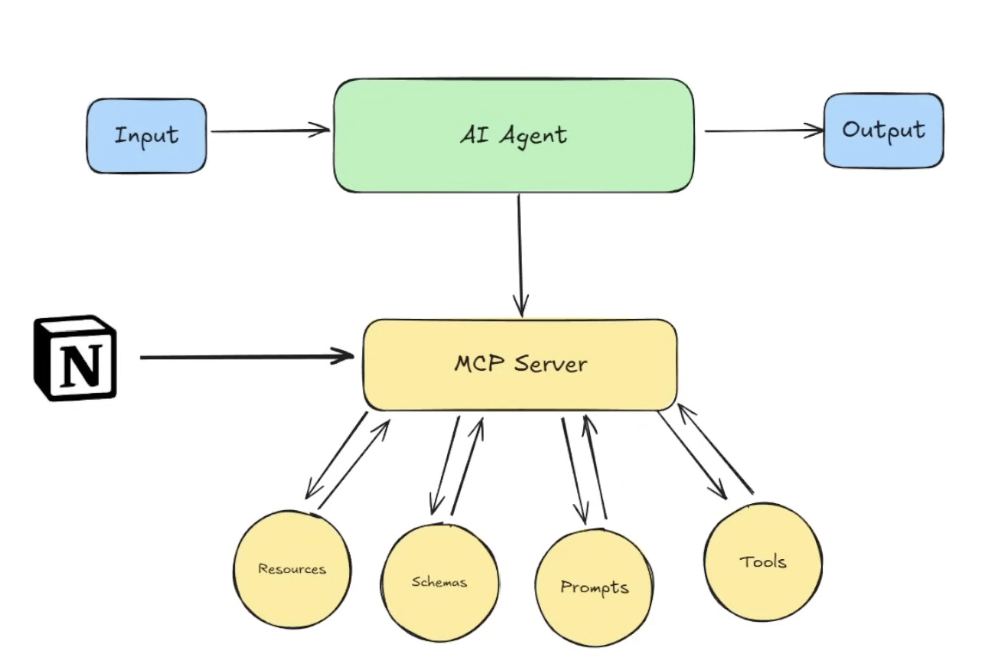


> Goal: Connect **Claude Desktop** to an **n8n** workflow via the **MCP Server Trigger** so you can call n8n tools (e.g., Calculator, Send Email) directly from a Claude chat.

---

## What You’ll Build

- A working MCP bridge from Claude Desktop → n8n (via SSE)
- An n8n workflow exposing:
  - **Calculator** tool (for math)
  - **Send Email** tool (Gmail)
- A simple chat prompt in Claude that sends a real email via n8n

---

## Prerequisites

1. **Claude Desktop** installed on macOS or Windows — download: <https://www.claude.com/download>
2. **n8n** (Cloud or self‑hosted) with a reachable URL
3. **Node.js + npx** available on your machine (for the gateway CLI)
4. (Recommended) A Gmail or Google Workspace account for sending email (OAuth recommended)

> **Tip:** On self‑hosted n8n behind a proxy, ensure `/mcp*` paths allow long‑lived **SSE** connections and disable proxy buffering for those routes.

---

## File Locations You Will Edit

- **macOS:** `~/Library/Application Support/Claude/claude_desktop_config.json`
- **Windows:** `%APPDATA%\\Claude\\claude_desktop_config.json`

If the file does not exist, **create it**.

---

## 1) Install Claude Desktop (macOS / Windows)

1. Download & install **Claude Desktop** for your OS: <https://www.claude.com/download>.
2. Launch it once so the app creates its support folder.

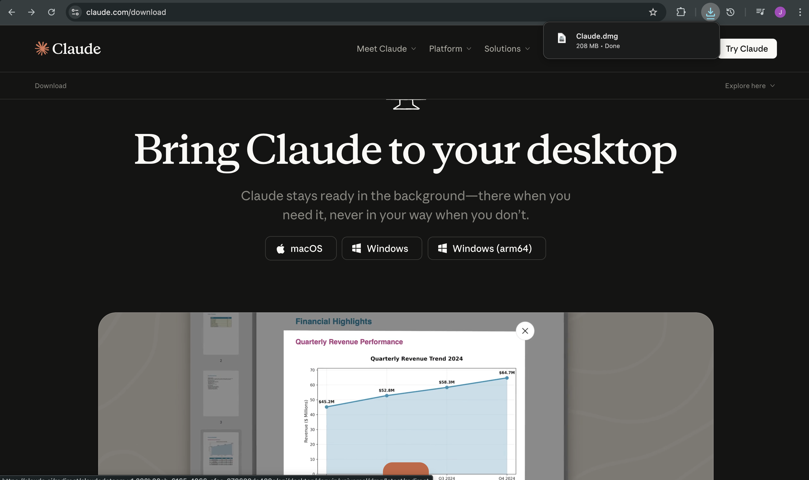

---

## 2) Open Settings → Developer → Edit Config

1. In Claude Desktop, open **Settings**.
2. Go to **Developer** (or **Extensions** in newer builds) and click **Edit Config**.
3. This opens the folder that contains `claude_desktop_config.json`.

> If you don’t see the file, create it manually with that exact name.

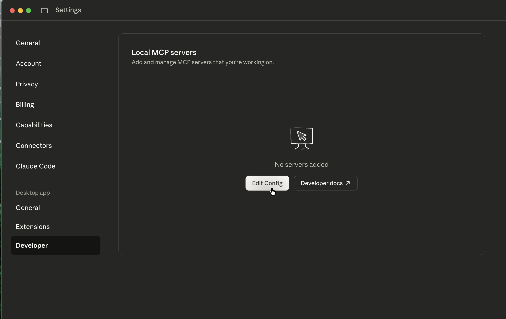

---

## 3) Open `claude_desktop_config.json` in an editor

- Use any editor (e.g., **VS Code**). Keep it **valid JSON** (no trailing commas, no extra quotes around the whole object).

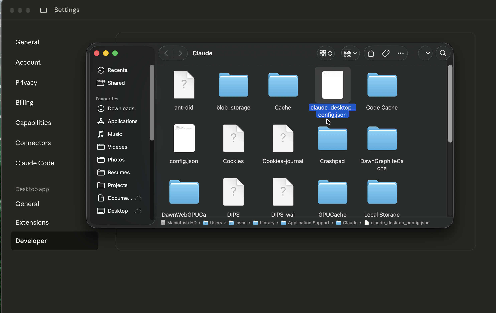

---

## 4) Paste this **working** config (via Supergateway)

> Replace `<YOUR_N8N_MCP_PRODUCTION_SSE_URL>` with your **Production** MCP URL from the **MCP Server Trigger** node (Step 6).

```json
{
  "mcpServers": {
    "n8n": {
      "command": "npx",
      "args": [
        "-y",
        "supergateway",
        "--sse",
        "<YOUR_N8N_MCP_PRODUCTION_SSE_URL>"
      ]
    }
  }
}
```

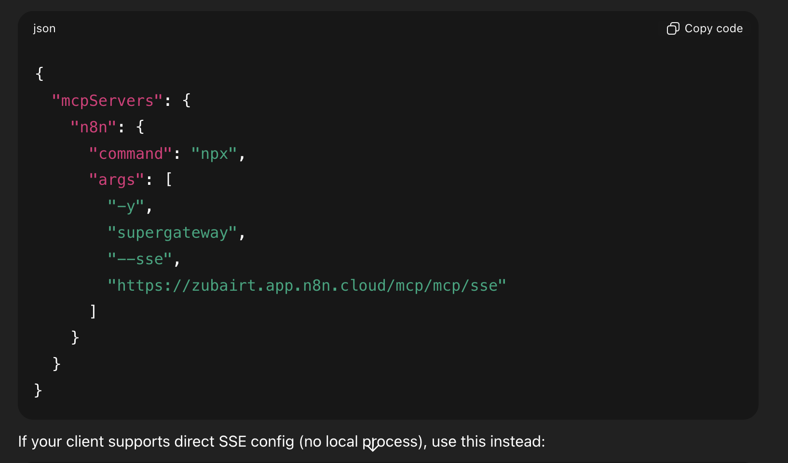

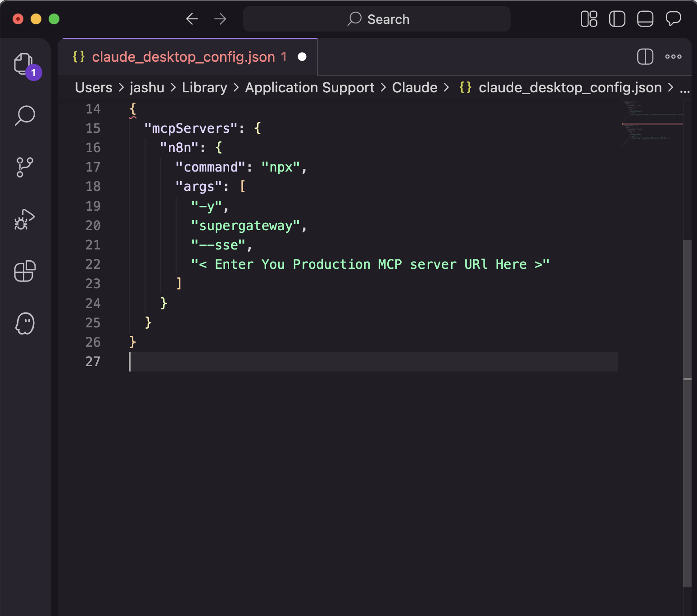

> **Notes**
> - Do **not** wrap the entire JSON in quotes.
> - Windows paths in JSON must escape backslashes (e.g., `\"C:\\\\Path\\\\To\"`).
> - If your n8n is behind a load balancer with multiple replicas, route all `/mcp*` traffic to a **single** instance for stable SSE.

---

## 5) In n8n: Create a Workflow & Add **MCP Server Trigger**

1. Create a **new workflow**.
2. Search for **“MCP Server Trigger”** and add it to the canvas.
3. (Optional) Configure **Authentication** if you’re protecting your endpoint.
4. **Save** the workflow.

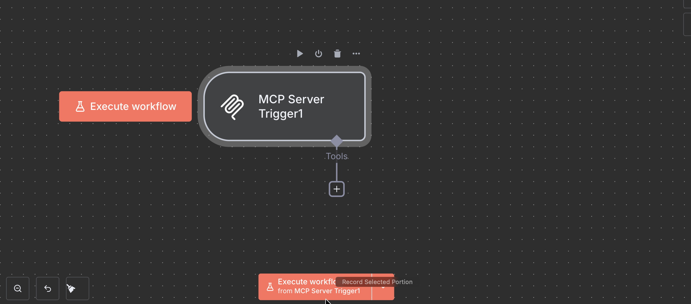

> The node displays **Test** and **Production** URLs at the top.

---

## 6) Copy the **Production** MCP URL (SSE)

1. **Activate** the workflow (toggle **Active** on).
2. In the **MCP Server Trigger** panel, switch the URL to **Production**.
3. Copy the **Production URL** — this is your `<YOUR_N8N_MCP_PRODUCTION_SSE_URL>` for Step 4.

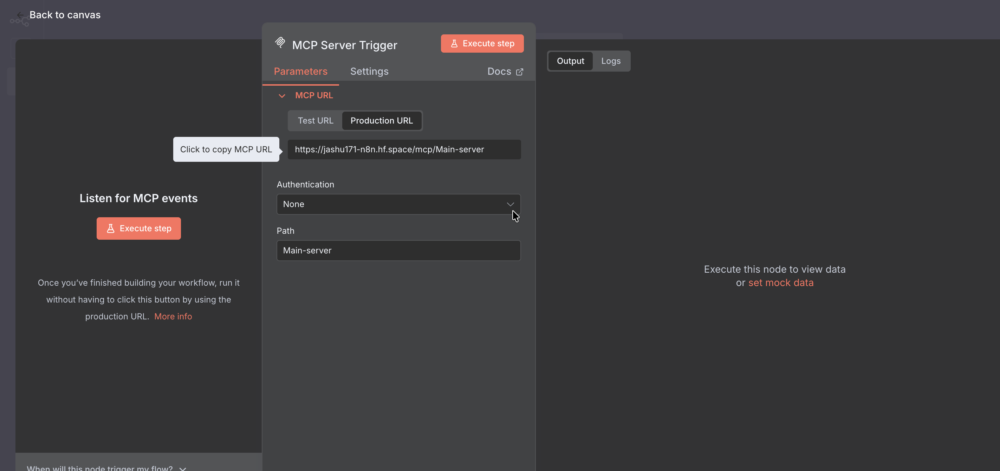

> **Why Production?** Test URLs only work while you press “Listen for test event.” Production URLs persist and are meant for clients like Claude.

---

## 7) Quit & Restart Claude Desktop

1. Fully **Quit** (not just close) Claude Desktop.
2. Re‑open it so it reloads `claude_desktop_config.json`.

---

## 8) Back in n8n: Add Your **Tools**

You expose tools by connecting **tool nodes** in the same workflow as the **MCP Server Trigger**.

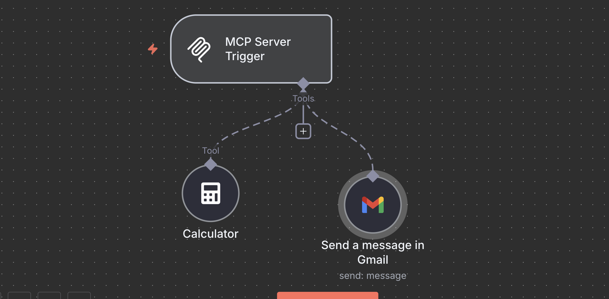

### 8.1 Calculator Tool
1. Add **Calculator** tool node.
2. Keep defaults for basic math.

### 8.2 Email Tool (Gmail)

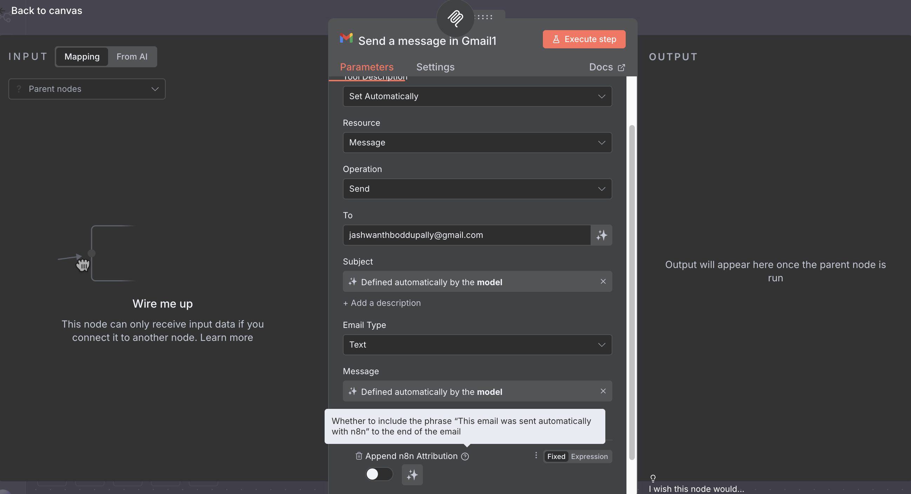

1. Add **Gmail** node.
2. Set **Resource: Message**, **Operation: Send**.
3. Set **To**, **Subject**, and **Message**.
4. Add **Google Credentials** (OAuth recommended).

> **Important:** Leave your workflow **Active**.

---

## 9) Verify in Claude: Settings → Developer

1. In Claude, open **Settings → Developer**.
2. Under **Model Context Protocol (MCP) servers**, you should see **“n8n — Running.”**
   - If not, see **Troubleshooting** below.

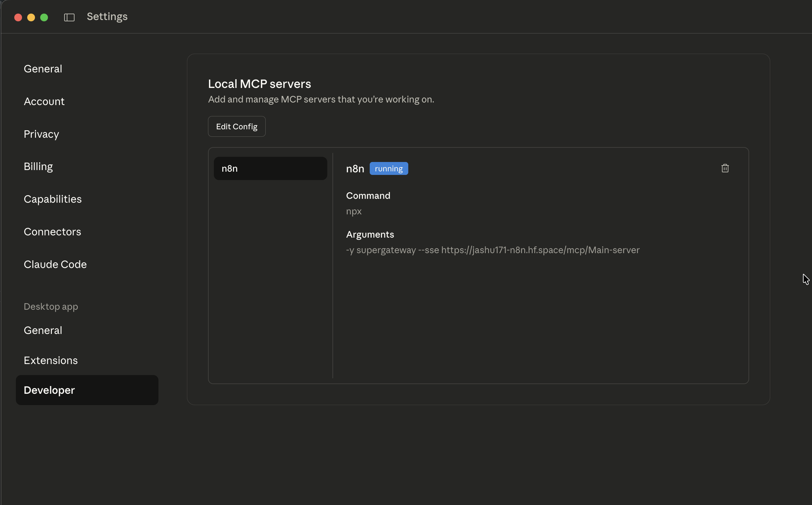

---

## 10) Use It in a New Chat

1. Open a **new chat**.
2. In the **Tools** panel, toggle **n8n** to **On**.
3. Try a prompt that exercises your tools, for example:
   - “**Send an email** with subject `About AI Agents` and a professional body explaining what AI agents are. Use my n8n email tool.”
   - “**Calculate** 17.3% of 4,560, then round to 2 decimals.”

If parameters are missing, Claude may ask follow‑up questions.

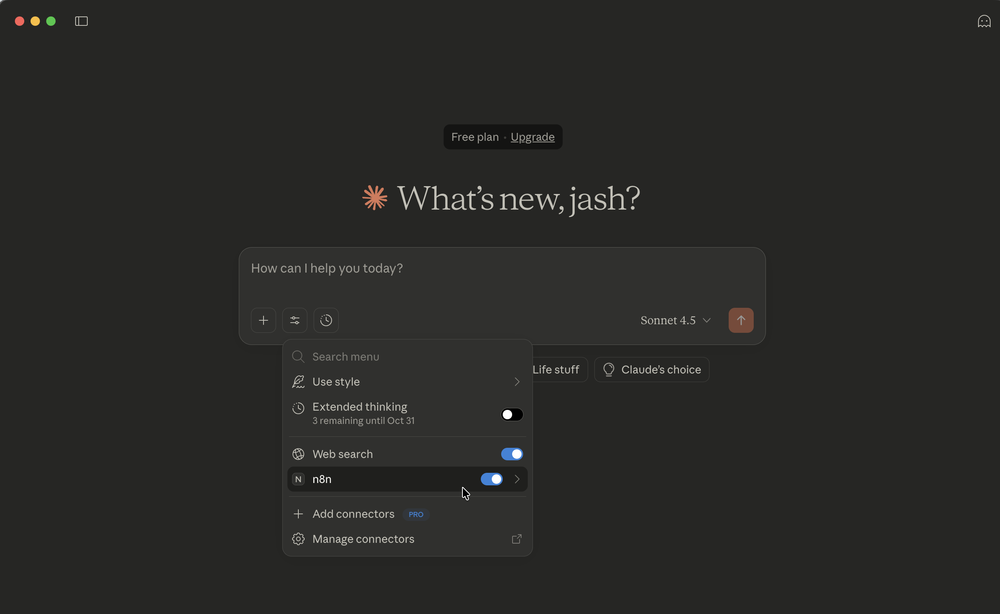

---

## 11) Check the Mailbox

- Confirm the message arrived. If not, check the **Executions** tab in n8n for errors.

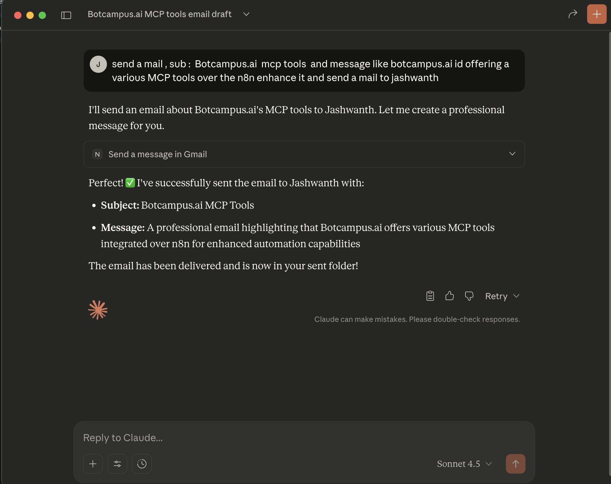

---

## Troubleshooting

**Claude doesn’t show “n8n — Running”**
- Validate JSON (no trailing commas, proper braces).
- Ensure you **Quit** & relaunch Claude after edits.
- Confirm your **Production** URL, not **Test**.
- Try the SSE with `curl -N <YOUR_N8N_MCP_PRODUCTION_SSE_URL>` — you should see streaming events.
- Corporate proxies/firewalls can break SSE — test off‑VPN.

**Connection flaps / drops**
- Behind a proxy/load balancer? Route all `/mcp*` to a **single** webhook replica.
- Disable proxy buffering/compression for `/mcp*` routes.

**Email fails to send (Gmail)**
- Check OAuth scopes and the selected **From** identity.
- Verify the **To** address, Subject/Message fields, and credentials.
- Check n8n **Executions** logs for the Gmail node.

**Windows tips**
- JSON escaping: `\\\\` in file paths.
- Use quotes around args with spaces when launching tools directly (not needed in the JSON arrays above).

---

## Security Notes

- Treat your Production MCP URL like a password.
- Use n8n node‑level auth if exposing your endpoint publicly.
- Rotate tokens/credentials periodically and remove unused workflows.

---

## Appendix A — Minimal, Copy‑Paste Config

**Simple config (via Supergateway)**
```json
{
  "mcpServers": {
    "n8n": {
      "command": "npx",
      "args": [
        "-y",
        "supergateway",
        "--sse",
        "<YOUR_N8N_MCP_PRODUCTION_SSE_URL>"
      ]
    }
  }
}
```

---

## Appendix B — Quick Verification Commands

```bash
# 1) Verify your SSE endpoint streams events
curl -N <YOUR_N8N_MCP_PRODUCTION_SSE_URL>

# 2) JSON validate with jq (macOS path example)
jq . < "${HOME}/Library/Application Support/Claude/claude_desktop_config.json" > /dev/null && echo "JSON OK"
```

---

## You’re Done 🎉

- Claude shows **n8n — Running** in **Settings → Developer**.
- In a new chat, toggle **n8n** On and prompt:  
  “*Send an email with subject `About AI Agents` and a professional body explaining AI agents.*”

If you want to add more screenshots, send them and specify which step they illustrate and I’ll place them accordingly.
