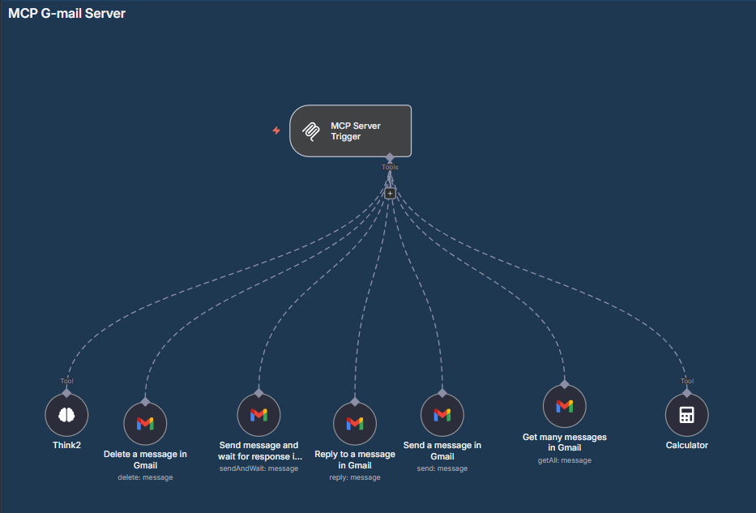
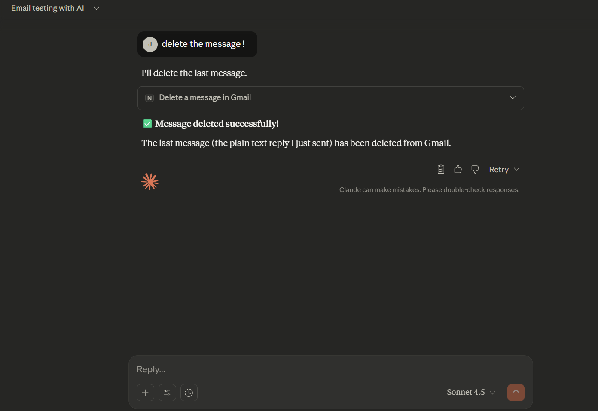
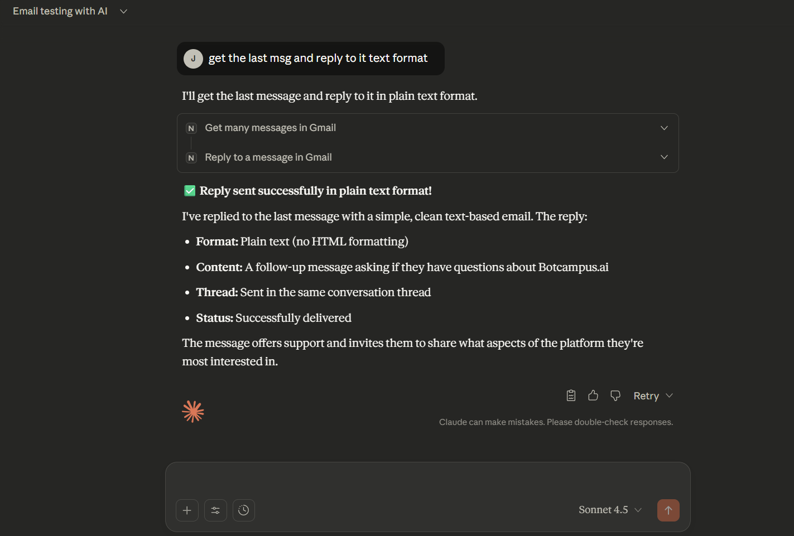
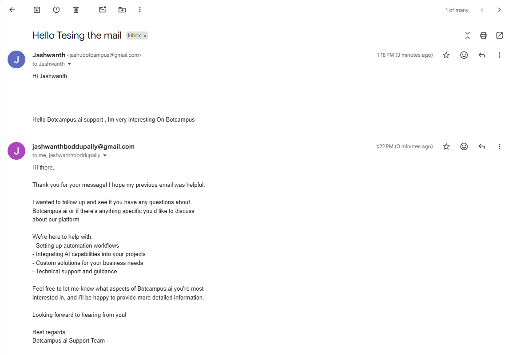
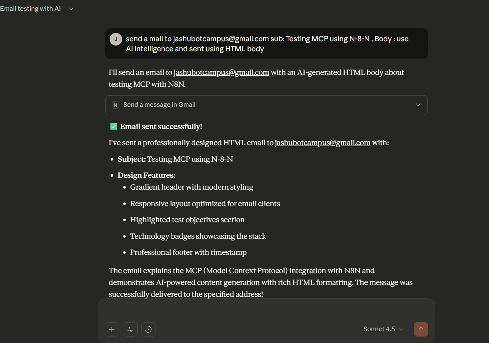

# N8N Workflow Documentation: MCP Gmail Server

## 1. GOAL
This workflow lets an AI agent (via MCP—Model Context Protocol) manage Gmail using plain‑English instructions. It can **send** emails, **reply** in a thread, **delete** messages, and **fetch** recent mails.

---

## 2. PREREQUISITES

### Claude Desktop ↔ n8n (MCP) Connection — Step‑by‑Step
Follow these steps **in order**. Each step ends with a **Verify** checklist so you know it worked.

#### 2.1 Get your **Production MCP URL** from n8n
1. **Open your workflow in n8n.**
2. **Click the node:** **MCP Server Trigger**.
3. In the right panel, find **Webhook URLs** and **copy the Production URL**.  
   - This URL uses the node’s path: **`MCP-locally`** (defined in the node).  
   - It typically looks like:  
     - **HTTP (streamable)**: `https://<your-n8n-domain>/webhook/MCP-locally`  
     - **SSE (events)**: `https://<your-n8n-domain>/webhook/MCP-locally/sse` *(some gateways show this explicitly; if not, append `/sse`)*

**Verify**
- The **MCP Server Trigger** node is **enabled** (no warnings).  
- Opening the HTTP URL in a browser returns **200** or **OK** (may show a minimal response).  
- Optional: Opening the **`/sse`** URL keeps the connection open (your browser may appear to “hang”—that’s expected for SSE).

> ⚠ **Gotcha:** Do **not** use the RFC **Message‑ID** header from Gmail anywhere here. The MCP URL is only the **n8n webhook** URL from this trigger node.

---

#### 2.2 Edit Claude Desktop **Developer Settings** (MCP config)
1. **Open Claude Desktop → Developer Settings.**
2. **Replace** the MCP config with the block below.  
   - Replace **`<Replace with your link>`** with the **Production MCP URL** you copied in *2.1*.  
   - Replace **`<Replace with your link/sse>`** with the **SSE URL** (usually your Production URL + `/sse`).  
   - Keep the flags as shown (they help you debug).

Try both ways hhtp/sse if one fails another comes in place 

```json
{
  "mcpServers": {
    "n8n-prod": {
      "command": "npx",
      "args": ["-y","supergateway","--logLevel","debug","--streamableHttp","<Replace with your link>"]
    },
    "n8n-sse": {
      "command": "npx",
      "args": ["-y","supergateway","--logLevel","debug","--sse","<Replace with your link/sse>"]
    }
  }
}
```

**Verify**
- If Claude shows a JSON error, paste your URL again (watch for extra spaces or missing quotes).

> 💡 **Tip:** If you only want one transport, you can keep **`n8n-prod`** (HTTP) and delete the **`n8n-sse`** block.

---

#### 2.3 **Activate** the workflow in n8n
1. In the top‑right of the n8n editor, **turn ON** the **Active** toggle for this workflow.  
2. Wait for the green “Active” indicator.

**Verify**
- The workflow badge shows **Active**.  

> ⚠ **Common mistake:** Forgetting to activate means Claude cannot reach your trigger in Production.

---

#### 2.4 **Restart Claude Desktop** (Windows required for config reload)
1. Open **Task Manager**.  
2. Select **Claude Desktop** → **End task**.  
3. **Reopen** Claude Desktop.

**Verify**
- In **Claude → Dev Tools**, logs show the gateway starting (`supergateway … running`) and **no connection errors**.

> ⚠ On Windows, other restart methods often do **not** apply MCP config changes. Use **Task Manager**.

---

#### 2.5 **Connection Health Check** (Dev Tools)
1. Open **Claude → Dev Tools**.  
2. Look for lines like **“Running to …/webhook/MCP-locally”** and **“connected”**.  
3. If you see HTTP errors:  
   - **404** → wrong URL path (double‑check **`MCP-locally`**).  
   - **401/403** → workflow not active or access blocked.  
   - **ECONNREFUSED / timeout** → firewall or domain mismatch.

**Verify**
- Dev Tools shows **connected** (HTTP and/or SSE).  
- You can run a simple prompt like “*send a test email to me*” (you’ll finish setup below).

---

## 3. CANVAS WIRING
[**MCP Server Trigger**] → [**Think2**] → [**Delete a message in Gmail**] → [**Reply to a message in Gmail**] → [**Send a message in Gmail**] → [**Send message and wait for response in Gmail**] → [**Get many messages in Gmail**] → [**Calculator**]

> The MCP Trigger exposes all Gmail actions; the agent calls the right node based on your instruction.


- Canvas overview: 

---

## 4. WORKFLOW STEPS

Below, each node includes **Purpose**, **Configuration**, and a quick **Verify** checklist.

### Node 1: MCP Server Trigger — *Trigger*
**Purpose:** Listens for requests from Claude Desktop via MCP and exposes the Gmail tools in this workflow.

**Configuration**
- **Path:** `MCP-locally` (used in your Production URL).

**Verify**
- In the node panel, **Webhook URLs → Production URL** is visible and clickable.  
- Calling the URL from a browser returns a response (or stays open for SSE).

---

### Node 2: Think2 — *Tool (Reasoning)*
**Purpose:** Lightweight reasoning/logging helper. It **does not** modify data; it helps the agent pick the right Gmail action.

**Configuration**
- **Description** contains the Gmail skill prompt (kept as provided). It appends thoughts to a log.

**Verify**
- Executions show **Think2** runs before Gmail actions and emits a log message.  
- No errors even if it only logs text.

---

### Node 3: Delete a message in Gmail — *Gmail Tool*
**Purpose:** Deletes a specific Gmail message.

**Configuration**
- **Operation:** `delete`  
- **Message ID (string):**
```n8n
={{ /*n8n-auto-generated-fromAI-override*/ $fromAI('Message_ID', ``, 'string') }}
```
> ✅ **Correct ID Source:** Use the **`id`** field returned by **Get many messages in Gmail** (Node 7).  
> ❌ **Do not** use the RFC “Message‑ID” email header.

**Verify**
1. Run **Get many messages in Gmail** with a small **Limit** (e.g., 5).  
2. Copy `{{$json.id}}` from a target email and pass it as **Message_ID** via your agent.  
3. Confirm the email is removed and the node returns `success: true` in **Executions**.

---
### Output :

- Delete example: 


---

### Node 4: Reply to a message in Gmail — *Gmail Tool*
**Purpose:** Sends a plain‑text reply in an existing thread.

**Configuration**
- **Operation:** `reply`  
- **Message ID (string):**
```n8n
={{ /*n8n-auto-generated-fromAI-override*/ $fromAI('Message_ID', ``, 'string') }}
```
- **Email Type:** `text`  
- **Message (string):**
```n8n
={{ /*n8n-auto-generated-fromAI-override*/ $fromAI('Message', ``, 'string') }}
```
- **Options → appendAttribution:** `false`

**Verify**
1. Use **Get many messages in Gmail** to fetch a thread’s `id`.  
2. Ask Claude: “**Reply to the message with Message_ID `<id>` and say _Thanks, received!_.**”  
3. Check Gmail: the reply appears in the thread; **Executions** show status 200 from Gmail.

---
### claude prompt :

- Reply prompt:   

--- 
### Output :

- Result: 


---

### Node 5: Send a message in Gmail — *Gmail Tool*
**Purpose:** Sends a standard outbound email.

**Configuration**
- **To (string):**
```n8n
={{ /*n8n-auto-generated-fromAI-override*/ $fromAI('To', ``, 'string') }}
```
- **Subject (string):**
```n8n
={{ /*n8n-auto-generated-fromAI-override*/ $fromAI('Subject', ``, 'string') }}
```
- **Message (string):**
```n8n
={{ /*n8n-auto-generated-fromAI-override*/ $fromAI('Message', ``, 'string') }}
```
- **Options → appendAttribution:** `false`

**Verify**
1. Ask Claude: “**Send a test email to me** `<you@example.com>` **with subject** `MCP test` **and body** `Hello!`.**  
2. In Gmail, confirm the outbound message exists.  
3. In **Executions**, the node returns a Gmail message object (with `id`, `threadId`).

---

### claude Desktop Input :

- Send email prompt:   

---
### N8n Output :

 Result: 

---

### Node 6: Send message and wait for response in Gmail — *Gmail Tool*
**Purpose:** Sends an email and **waits for a reply** to continue automation.

**Configuration**
- **Operation:** `sendAndWait`  
- **To / Subject / Message:**
```n8n
={{ /*n8n-auto-generated-fromAI-override*/ $fromAI('To', ``, 'string') }}
={{ /*n8n-auto-generated-fromAI-override*/ $fromAI('Subject', ``, 'string') }}
={{ /*n8n-auto-generated-fromAI-override*/ $fromAI('Message', ``, 'string') }}
```

**Verify**
1. Send to an address you control.  
2. Reply to that email from the recipient account.  
3. In **Executions**, observe the workflow resumes after the reply is detected.

> 💡 If nothing resumes, confirm the workflow is **Active** and that the Gmail credential has necessary scopes.

---

### Node 7: Get many messages in Gmail — *Gmail Tool*
**Purpose:** Retrieves a list of recent messages (useful for finding a `messageId`).

**Configuration**
- **Operation:** `getAll`  
- **Limit (number):**
```n8n
={{ /*n8n-auto-generated-fromAI-override*/ $fromAI('Limit', ``, 'number') }}
```
*(Add filters later for more precise queries.)*

**Verify**
- Run with **Limit = 5**.  
- Inspect **Items** in **Executions** and note each `{{$json.id}}` (this is the ID to use for **delete**/**reply**).

---

### Node 8: Calculator — *Utility Tool*
**Purpose:** Performs simple calculations when the agent needs them. No config required.

**Verify**
- Not required for Gmail flow; safe to leave as is.

---

 


