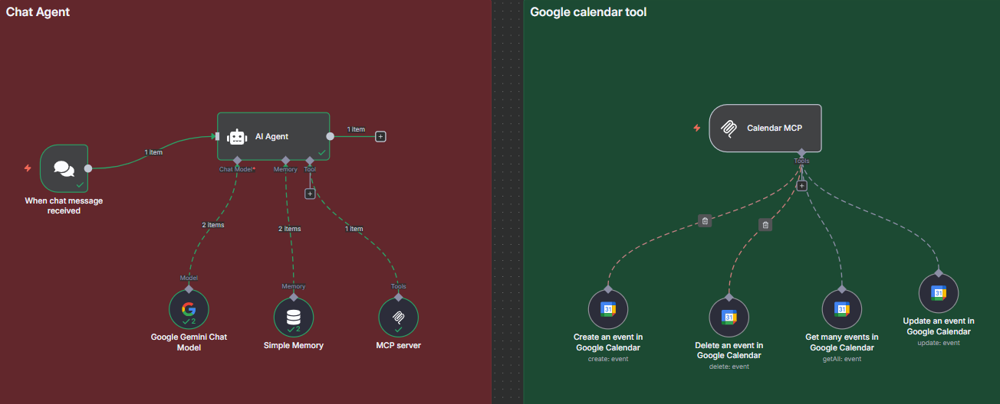
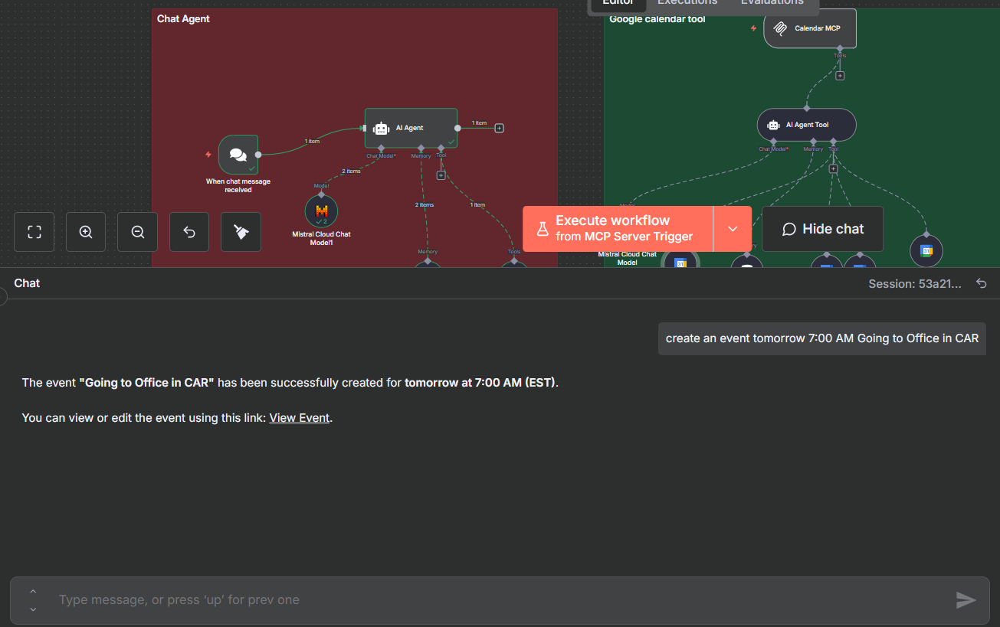
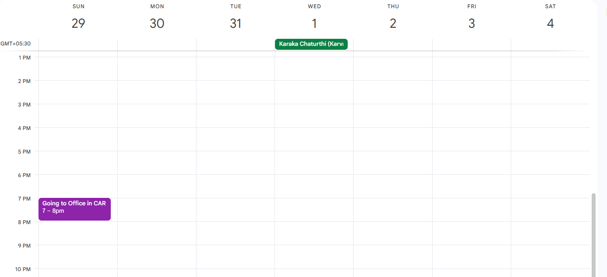
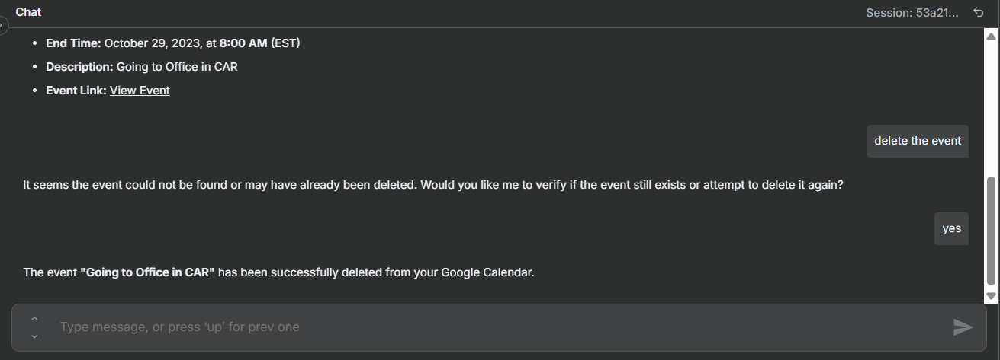
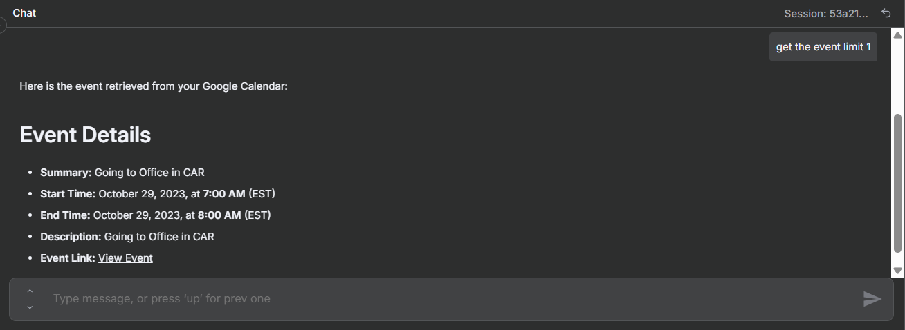

# Chat Agent → Google Calendar MCP — Ultra-Clear n8n Guide

**Workflow ID/Name:** `MCP+N8n-AI-agent-workflow`

This guide documents an n8n workflow where a chat user can **create, list, update, or delete Google Calendar events** using natural language. The AI Agent (Gemini) interprets the message, calls the correct Calendar tool via **MCP**.

---

## Table of Contents
- [Goal](#goal)
- [Prerequisites](#prerequisites)
  - [Required Accounts & Access](#required-accounts--access)
- [Canvas Wiring](#canvas-wiring)
- [Workflow Steps (Node by Node)](#workflow-steps-node-by-node)
  - [Node 1 — When chat message received (Trigger)](#node-1--when-chat-message-received-trigger)
  - [Node 2 — AI Agent (Agent)](#node-2--ai-agent-agent)
  - [Node 3 — Google Gemini Chat Model (Language Model)](#node-3--google-gemini-chat-model-language-model)
  - [Node 4 — Simple Memory (Memory Buffer Window)](#node-4--simple-memory-memory-buffer-window)
  - [Node 5 — MCP server (MCP Client Tool)](#node-5--mcp-server-mcp-client-tool)
  - [Node 6 — Calendar MCP (MCP Trigger / Tool Group)](#node-6--calendar-mcp-mcp-trigger--tool-group)
  - [Node 7 — Create an event in Google Calendar (Tool)](#node-7--create-an-event-in-google-calendar-tool)
  - [Node 8 — Delete an event in Google Calendar (Tool)](#node-8--delete-an-event-in-google-calendar-tool)
  - [Node 9 — Get many events in Google Calendar (Tool)](#node-9--get-many-events-in-google-calendar-tool)
  - [Node 10 — Update an event in Google Calendar (Tool)](#node-10--update-an-event-in-google-calendar-tool)
- [Date/Time Handling](#datetime-handling)
- [Troubleshooting](#troubleshooting)
  - [Quick Smoke Tests](#quick-smoke-tests)
- [Security Notes](#security-notes)
- [Appendix — Node Types Recap](#appendix--node-types-recap)
- [Contributors](#contributors)
- [License](#license)

---

## Goal

Enable a chat user to manage Google Calendar by typing natural language, e.g.:

> “create a meeting **tomorrow 3–4 pm** called **Project Sync**”

The **AI Agent** understands the message and calls the right Calendar tool automatically.


---

## Prerequisites

### Required Accounts & Access
- **n8n (latest)** with AI nodes enabled (self-hosted or Cloud)
- **Google account** with Calendar enabled
- **Google Cloud project** (to configure OAuth for Calendar)
- **Google Gemini API key** (for the chat model)
- **MCP server endpoint** reachable from n8n (HTTP or SSE gateway, e.g., **Supergateway**)

---

## Canvas Wiring

```
[Chat Trigger] 
  → [AI Agent (Gemini + Simple Memory + MCP Client Tool)] 
    → [Calendar MCP Trigger (tool group)] 
      → [Google Calendar Tools: Create | Get many | Update | Delete]
```

**Visual:**  


---

## Workflow Steps (Node by Node)

### Node 1 — When chat message received (Trigger)
- **Type:** `@n8n/n8n-nodes-langchain.chatTrigger`  
- **Purpose:** Starts the workflow whenever a new chat message arrives.  
- **Config:** Defaults are fine unless you use a custom Webhook ID/chat surface.

### Node 2 — AI Agent (Agent)
- **Type:** `@n8n/n8n-nodes-langchain.agent`  
- **Purpose:** Understands the user’s instruction, selects the correct Calendar tool, and populates fields.
- **Connections:**
  - **Chat Model:** Google Gemini Chat Model
  - **Memory:** Simple Memory
  - **Tools:** MCP server (client) — calendar tools are available via **Calendar MCP trigger**.

**System Prompt** (paste into the **System / Instruction** field):
```
You are a calendar operations orchestrator.
- Understand natural language requests about Google Calendar (create, list, update, delete events).
- Choose the correct Calendar tool and supply the exact fields the tool expects.
- Default timezone: Asia/Kolkata if the user does not specify.
- Validate required fields BEFORE calling a tool:
  • Create: Start, End, Summary (optional: Description)
  • Get many: Limit (default 10), After (timeMin), Before (timeMax)
  • Update/Delete: Event_ID
- Return values using these exact field keys so $fromAI() bindings work:
  Start, End, Summary, Description, Limit, After, Before, Event_ID
- Ask clarifying questions only if required fields are missing or ambiguous.
- Respond concisely with what you did and key details (title, time).
```

**Chat UI (example input → tool selection)**  


**Chat Model Settings** (applied via the Gemini node):
- **Model:** `gemini-1.5-pro` (or compatible Gemini chat model)
- **Temperature:** `0.2` (focused, consistent outputs)
- **Max Tokens:** `1024` (enough for tool decisions + results)

### Node 3 — Google Gemini Chat Model (Language Model)
- **Type:** `@n8n/n8n-nodes-langchain.lmChatGoogleGemini`
- **Purpose:** Provides the LLM for reasoning and tool planning.
- **Credential:** Select your **Google PaLM/Gemini API** key credential.
- **Suggested Settings:**
  - **Model:** `gemini-1.5-pro`
  - **Temperature:** `0.2`
  - **Max Output Tokens:** `1024`

### Node 4 — Simple Memory (Memory Buffer Window)
- **Type:** `@n8n/n8n-nodes-langchain.memoryBufferWindow`
- **Purpose:** Keeps recent turns so the Agent remembers context (e.g., event title mentioned earlier).
- **Config:** `contextWindowLength = 50`

---
# MCP Part : 

### Node 5 — MCP server (MCP Client Tool)
- **Type:** `@n8n/n8n-nodes-langchain.mcpClientTool`
- **Purpose:** Connects the Agent to your MCP endpoint (HTTP/SSE).
- **Configuration — Endpoint URL:**
```
http://localhost:5678/mcp/MCP-locally
```
> Replace `localhost` if n8n runs inside Docker/VM and cannot reach the host. Verify with a `curl` **from the n8n host/container**.

### Node 6 — Calendar MCP (MCP Trigger / Tool Group)
- **Type:** `@n8n/n8n-nodes-langchain.mcpTrigger`
- **Purpose:** Groups and exposes the Calendar tool nodes to the Agent.
- **Config:**
  - **Path:** `Calendar-tool` (becomes the trigger/webhook path)
- **Tools under this MCP trigger:**
  - **Create an event in Google Calendar**
  - **Get many events in Google Calendar**
  - **Update an event in Google Calendar**
  - **Delete an event in Google Calendar**

### Node 7 — Create an event in Google Calendar (Tool)
- **Type:** `n8n-nodes-base.googleCalendarTool` (**operation:** `create: event`)
- **Purpose:** Creates a new event with start/end and details.
- **Credential:** `Google Calendar OAuth2 API`

**Configuration**  
- **Calendar:** *(choose your calendar ID)*

**Start**
```js
={{ /*n8n-auto-generated-fromAI-override*/ $fromAI('Start', ``, 'string') }}
```

**End**
```js
={{ /*n8n-auto-generated-fromAI-override*/ $fromAI('End', ``, 'string') }}
```

**Additional Fields → Summary**
```js
={{ /*n8n-auto-generated-fromAI-override*/ $fromAI('Summary', ``, 'string') }}
```

**Additional Fields → Description**
```js
={{ /*n8n-auto-generated-fromAI-override*/ $fromAI('Description', ``, 'string') }}
```

**Result (example):**  


> **Why these expressions?** `$fromAI()` maps the Agent’s structured output directly into the tool’s fields, ensuring deterministic field-to-value binding.

### Node 8 — Delete an event in Google Calendar (Tool)
- **Type:** `n8n-nodes-base.googleCalendarTool` (**operation:** `delete`)
- **Purpose:** Deletes a specific event by ID.
- **Credential:** `Google Calendar OAuth2 API`

**Configuration**  
- **Calendar:** *(same as above)*

**Event ID**
```js
={{ /*n8n-auto-generated-fromAI-override*/ $fromAI('Event_ID', ``, 'string') }}
```

**Result (example):**  


> **Tip:** If you don’t know the ID, run **Get many** first to list events and copy the `id`.

### Node 9 — Get many events in Google Calendar (Tool)
- **Type:** `n8n-nodes-base.googleCalendarTool` (**operation:** `getAll`)
- **Purpose:** Lists events within a range; helpful for finding `Event_ID` for updates/deletes.
- **Credential:** `Google Calendar OAuth2 API`

**Configuration**  
- **Calendar:** *(choose your calendar)*

**Limit**
```js
={{ /*n8n-auto-generated-fromAI-override*/ $fromAI('Limit', ``, 'number') }}
```

**timeMin (After)**
```js
={{ /*n8n-auto-generated-fromAI-override*/ $fromAI('After', ``, 'string') }}
```

**timeMax (Before)**
```js
={{ /*n8n-auto-generated-fromAI-override*/ $fromAI('Before', ``, 'string') }}
```

**Result (example):**  
 

### Node 10 — Update an event in Google Calendar (Tool)
- **Type:** `n8n-nodes-base.googleCalendarTool` (**operation:** `update`)
- **Purpose:** Updates fields of an existing event using `Event_ID`.
- **Credential:** `Google Calendar OAuth2 API`

**Configuration**  
- **Calendar:** *(choose your calendar)*

**Event ID**
```js
={{ /*n8n-auto-generated-fromAI-override*/ $fromAI('Event_ID', ``, 'string') }}
```

**Update Fields**  
Add only what you intend to change (e.g., `summary`, `description`, `start`, `end`, `attendees`, etc.).  
> Your export shows an empty `updateFields` block—fill as needed.

---

## Date/Time Handling

- **Default timezone:** `Asia/Kolkata` (if the user does not specify).
- **Format:** Provide **RFC3339 / ISO-8601** datetime strings to Google Calendar (e.g., `2025-10-28T15:00:00+05:30`).  
- **All-day events:** Supply dates without times or use start/end at midnight boundaries as required.
- The **Agent** should resolve natural language like “tomorrow 3–4 pm” into **Start/End** strings in the default timezone unless the user supplies one.

**Fields the Agent must return (exact keys):**
```
Start, End, Summary, Description, Limit, After, Before, Event_ID
```

---

## Troubleshooting

### 5.1 `redirect_uri_mismatch` (OAuth error)
**Why:** Redirect URI in Google Cloud does not exactly match n8n’s callback.  
**Fix:**
1. In Google Cloud → OAuth client → **Authorized redirect URIs**, add:
   ```
   https://<YOUR-N8N-DOMAIN>/rest/oauth2-credential/callback
   ```
2. Save, then re-connect the credential in n8n.  
**Verify:** Credential shows **Connected**; run **Get many** successfully.

### 5.2 `401/403` (API disabled or insufficient scope)
**Why:** Calendar API not enabled or wrong OAuth scopes.  
**Fix:**
- Enable **Google Calendar API** in Google Cloud → *APIs & Services*.
- Recreate/adjust OAuth client scopes to include Calendar **read/write**.  
**Verify:** Run **Get many**; expect a list (or empty array).

### 5.3 MCP endpoint unreachable (`ECONNREFUSED` / `ETIMEDOUT`)
**Why:** n8n cannot reach `http://localhost:5678/...` (container/host mismatch).  
**Fix:**
- Replace `localhost` with an address reachable by n8n (container hostname, host IP, or external URL).
- Confirm gateway (e.g., **Supergateway**) running and shows “listening”.  
**Verify:** From n8n host/container, `curl <your-mcp-endpoint>` returns a response.

### 5.4 Update/Delete says “Event not found”
**Why:** Wrong `Event_ID`.  
**Fix:** Use **Get many** for the correct date range, copy the `id` exactly.  
**Verify:** Retry **Update/Delete**; operation succeeds.

---

## Quick Smoke Tests

**Create:**  
> “Create a meeting **tomorrow 3–4 pm** titled **Project Sync**, description **weekly catch-up**.”  
→ New event appears.

**List:**  
> “List my **next 5 events** after **today**.”  
→ Returns event array; copy an `id`.

**Update:**  
> “Rename event with id `<paste id>` to **Project Sync — New**.”  
→ Title changes.

**Delete:**  
> “Delete event `<paste id>`.”  
→ Event removed.

---

## Security Notes

- Treat **OAuth client secrets** and **API keys** as sensitive. Store only in **n8n Credentials**.
- **Rotate** keys if exposed. Restrict OAuth client to required origins/redirects.
- Limit Calendar access to the **minimum necessary** calendar(s).

---


# OutPut:


 


## Appendix — Node Types Recap

- **Trigger:** `@n8n/n8n-nodes-langchain.chatTrigger`  
- **Agent:** `@n8n/n8n-nodes-langchain.agent`  
- **LLM:** `@n8n/n8n-nodes-langchain.lmChatGoogleGemini`  
- **Memory:** `@n8n/n8n-nodes-langchain.memoryBufferWindow`  
- **MCP Client:** `@n8n/n8n-nodes-langchain.mcpClientTool`  
- **MCP Trigger (Calendar group):** `@n8n/n8n-nodes-langchain.mcpTrigger`  
- **Calendar tools:** `n8n-nodes-base.googleCalendarTool` (**create / getAll / update / delete**)

---

## Contributors
- _Jashwanth_

## License
_Choose a license (e.g., MIT) and place it here._
