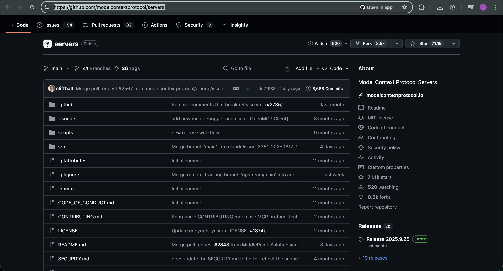
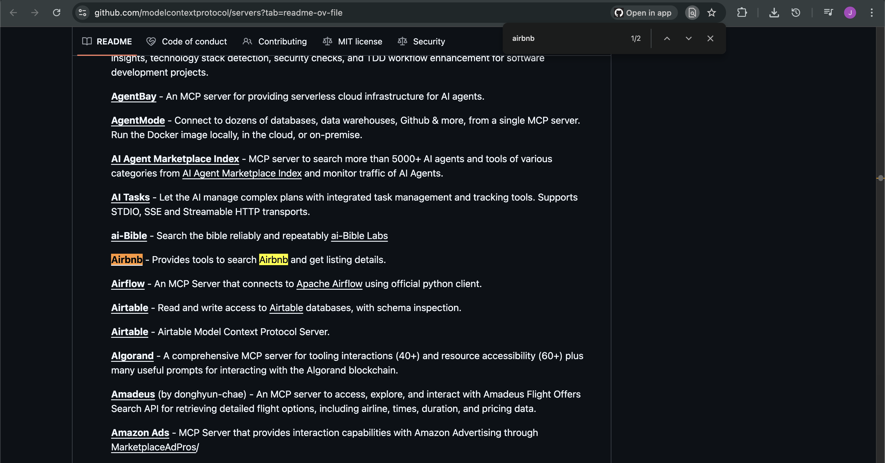
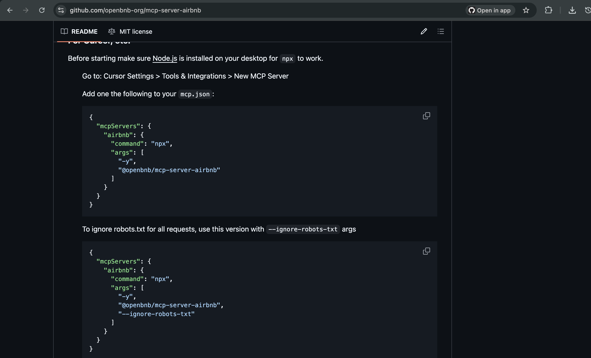
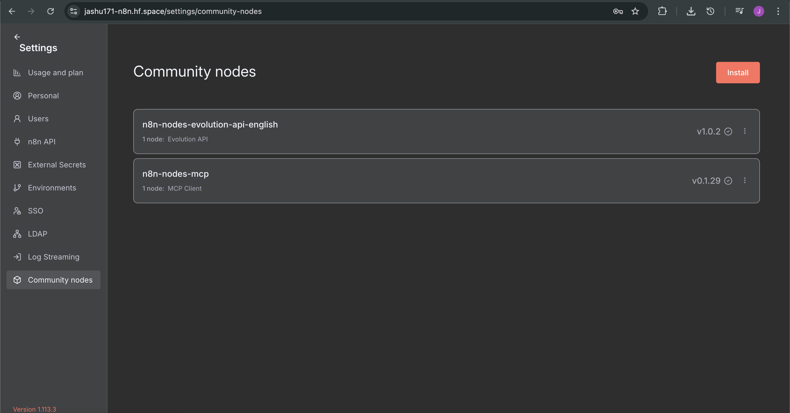
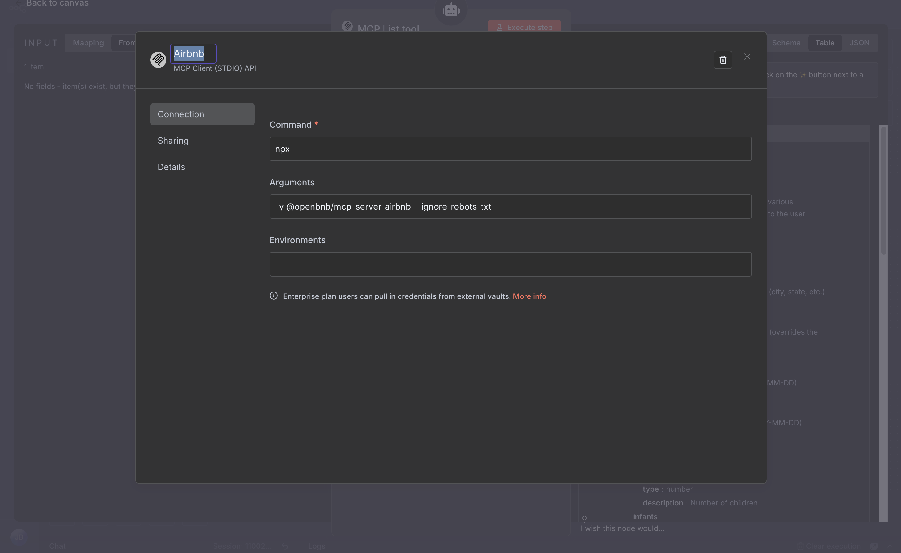

# Welcome to MCP World 🌍

### What is MCP ?

 MCP (Model Context Protocol) is a standard that lets AI assistants connect to external tools and data sources, call functions, and stream results in a consistent way.


---
Before directly Setp into the N8n workflow few set-up need to complete: (It is very common for any MCP servers)


# Follow steps:

## Step 1 — Choose your MCP server
- Official MCP servers index: 👉 https://github.com/modelcontextprotocol/servers  👈

  

For this guide we’ll use **Airbnb**:
- Repo: 👉🏻  https://github.com/openbnb-org/mcp-server-airbnb  👈🏻

  

### Open the Airbnb server repo
Scroll down until this config visible code snippet Copy It



 **You are Good to Go into N8N**

---

## Step 2 — Install the MCP Client (community node)

1. In n8n go to **Settings → Community nodes**.  

   
   
2. Click **Install** → paste: `n8n-nodes-mcp` → accept → **Install**.

This adds the **MCP Client** node to your canvas palette.

---

## Step 3 — Create the MCP credential (Command Line / STDIO)

You’ll create a credential that **spawns** the Airbnb MCP server with `npx`.

1. Open any workflow and search **“MCP Client”**; drop it on the canvas.  
   

2. In the node’s **Credentials**, click **Create new** → choose **Command Line (STDIO)**.

3. Fill the fields exactly:
  

**Command**
```
npx
```

**Arguments (ignore robots.txt)**
```
-y @openbnb/mcp-server-airbnb --ignore-robots-txt
```

> Prefer to respect robots.txt? Use:
```
-y @openbnb/mcp-server-airbnb
```

4. Name the credential (e.g., **MCP Airbnb (STDIO)**) → **Save**.

> **What this does:** when the MCP Client node runs, n8n starts the Airbnb MCP server process via `npx` and connects to it over **STDIO** (the MCP transport).

---

## Setup Completed ✅ 
Follow this approach any other STDIO API's
