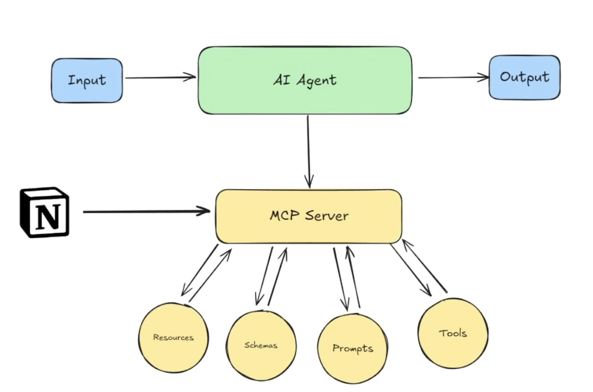
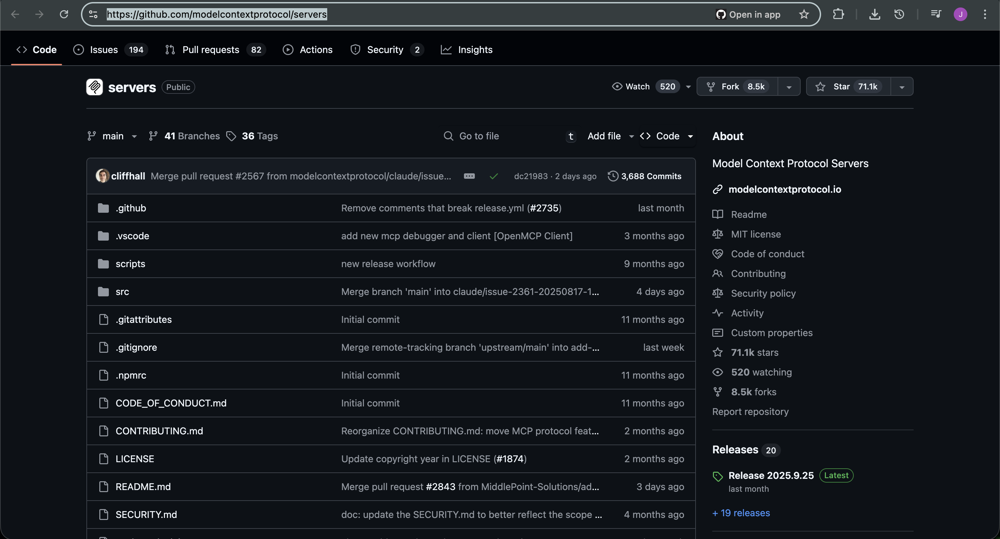
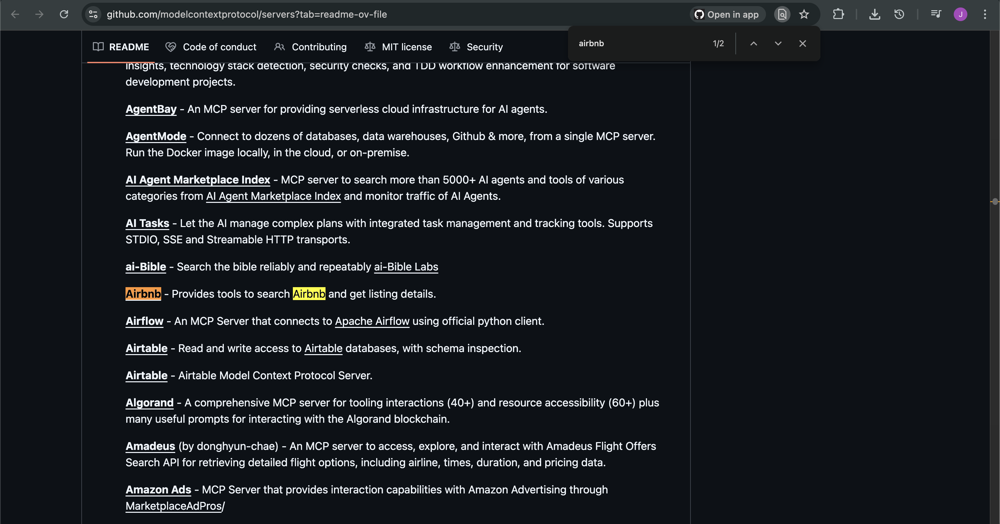
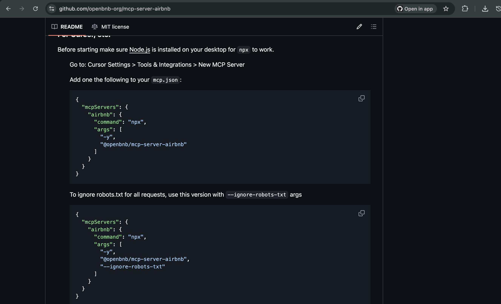
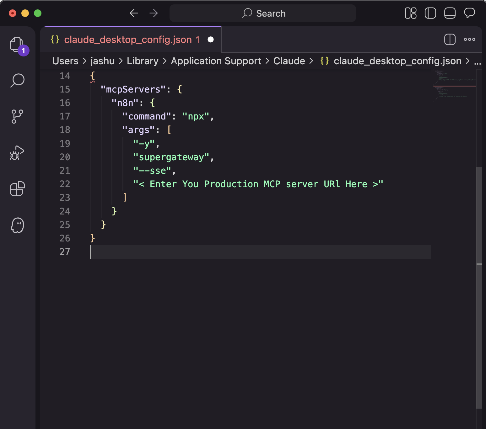
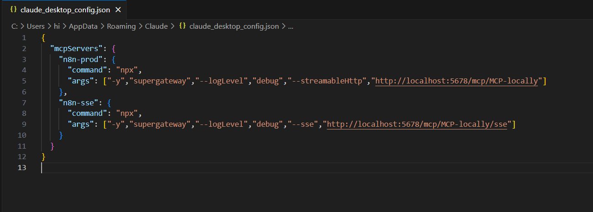

# Welcome to MCP World 🌍

### What is MCP ?

 MCP (Model Context Protocol) is a standard that lets AI assistants connect to external tools and data sources, call functions, and stream results in a consistent way.




---
Before directly Setp into the N8n workflow few set-up need to complete: (It is very common for any MCP servers)


# Follow steps:

## Step 1 — Choose your MCP server
- Official MCP servers index: 👉 https://github.com/modelcontextprotocol/servers  👈

  

For this guide we’ll use **Airbnb**:
- Repo: 👉🏻  https://github.com/openbnb-org/mcp-server-airbnb  👈🏻

  

### Open the Airbnb server repo
Scroll down until this config visible code snippet Copy It



 **You are Good to Go into N8N**

 ---
 ##  Paste this **working** config (SSE- only) (via Supergateway)

> Replace `<YOUR_N8N_MCP_PRODUCTION_SSE_URL>` with your **Production** MCP URL from the **MCP Server Trigger** node (Step 6).

```json
{
  "mcpServers": {
    "n8n": {
      "command": "npx",
      "args": [
        "-y",
        "supergateway",
        "--sse",
        "<YOUR_N8N_MCP_PRODUCTION_SSE_URL>"
      ]
    }
  }
}
```

---



---
# Config for both (SSE & HTTP) : 

   - Replace **`<Replace with your link>`** with the **Production MCP URL** you copied in *2.1*.  
   - Replace **`<Replace with your link/sse>`** with the **SSE URL** (usually your Production URL + `/sse`).  

Try both ways hhtp/sse if one fails another comes in place 

```json
{
  "mcpServers": {
    "n8n-prod": {
      "command": "npx",
      "args": ["-y","supergateway","--logLevel","debug","--streamableHttp","<Replace with your link>"]
    },
    "n8n-sse": {
      "command": "npx",
      "args": ["-y","supergateway","--logLevel","debug","--sse","<Replace with your link/sse>"]
    }
  }
}
```


> 💡 **Tip:** If you only want one transport, you can keep **`n8n-prod`** (HTTP) and delete the **`n8n-sse`** block.
--- 
### sample 



---

## Setup Completed ✅ 
Follow this approach any other STDIO API's
